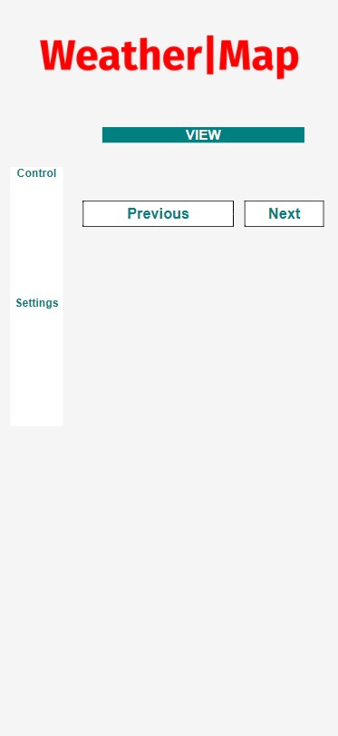
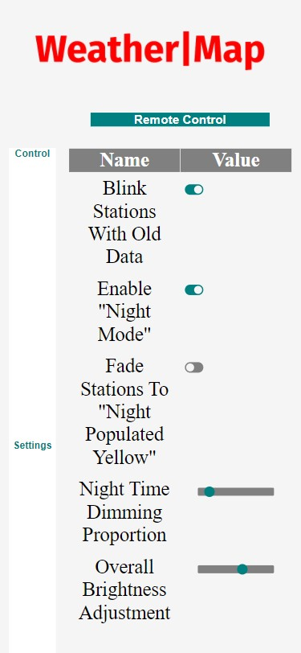

# Installing The Remote Control Software

This is an optional step that will allow you to control some features and options of your WeatherMap using another computer, tablet, or smartphone.

## Installing Node & Optional Config Server

Installing the remote control is optional.

To be able to reach the web controls you may need to change settings in your home router. Each router or modem will be different, but you may have the option to give a name to your WeatherMap device. This will allow you to reach your map by visiting <http://weathermap>

### Older Versions of Raspbian

1. `wget https://nodejs.org/dist/v11.15.0/node-v11.15.0-linux-armv6l.tar.gz`
2. `tar -xzf node-v11.15.0-linux-armv6l.tar.gz`
3. `sudo cp -R node-v11.15.0-linux-armv6l/* /usr/local/`
4. `sudo ln -s /usr/local/bin/node /usr/bin/node`
5. `cd ~/categorical-sectional/MapConfig`
6. `npm install`
7. `node /home/pi/categorical-sectional/MapConfig/build/index.js`
8. `sudo raspi-config`
9. "Network Options" -> "Hostname" -> "OK"
10. Set the name to `weathermap`
11. `crontab -e`
12. Add a new line that reads `@reboot python3 /home/pi/categorical-sectional/controller.py`
13. Save and quit.

### Buster / RaspberryPi OS

1. pip3 install spidev==3.4 --force-reinstall
2. sudo apt install nodejs
3. sudo apt install npm

You may now open a browser on another computer, or even you phone, and visit <http://weathermap>

From there you may adjust the map's brightness, the night time behavior, and more.

## Using The Remote

The remote allows for changes to be made to the configuration directly from a phone.

The changes are stored to the configuration in the user's directory: `~/weather_map/config.json`

The changes are also made immediately.

There are two main views:

- "Control"
- "Settings"

### Control

This is the default view when you load the site.

It allows you to cycle through the visualizers available. The currently weather visualizer will remain the default until you change it. This includes after a reboot.

The view "loops". So you may press "Next" or "Previous" until you return to the view you want.

Please note that it may take a few seconds for the data of a new view to start showing up. This is due to having to get additional data over the network.

### Settings

This allows you to change aspects of the WeatherMap to you liking, including the brightness.

All of the options are explained in the "Configuration" section of the [../readme.md] file.

For the brightness controls, the update to brightness does not happen until you "let go" of the slider.

Please note, that it is possible to turn the brightness all the way to "off".
