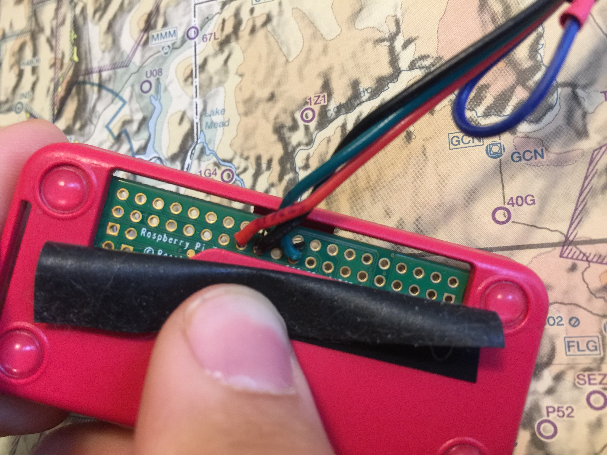

# WS2801 Wiring

## Summary

This file will guide you through wiring a WS2801 based LED system.

## Wiring the WS2801

If you are using multiple strands of lights, plug them together. Tape off the red and blue tap wires between the connectors and at the end of the strand.

Leave the read and blue wire at the start of the strand for the moment.

## The Barrel Jack Adapter

For the barrel jack, use the two thinner wires that come out of the top of the plastic connector from the LED lights.

One is red, the other blue.

- Blue -> Barrel jack minus
- Red -> Barrel jack positive

### Wiring Detail For Barrel Jack

## The Raspberry Pi

Use the group of four wires from a **male** JST SM adapter.

Solder them to the board.

Wire Color | Physical Pin                                | Pin Name
---------- | ------------------------------------------- | -------------
Blue       | Tied off and shrink wrapped. Not connected. | Not connected
Red        | 25                                          | GRND
Black      | 23                                          | SCLK
Green/Teal | 19                                          | MOSI

### Wiring Detail From Top

### Wiring Detail From Bottom

## Final Assembly

- Connect the Male JST and LED connectors together.
- Connect the barrel jack into the LED strip.
- Add the SD card to the Pi.
- Plug in the LEDs first, then the Raspberry Pi.
