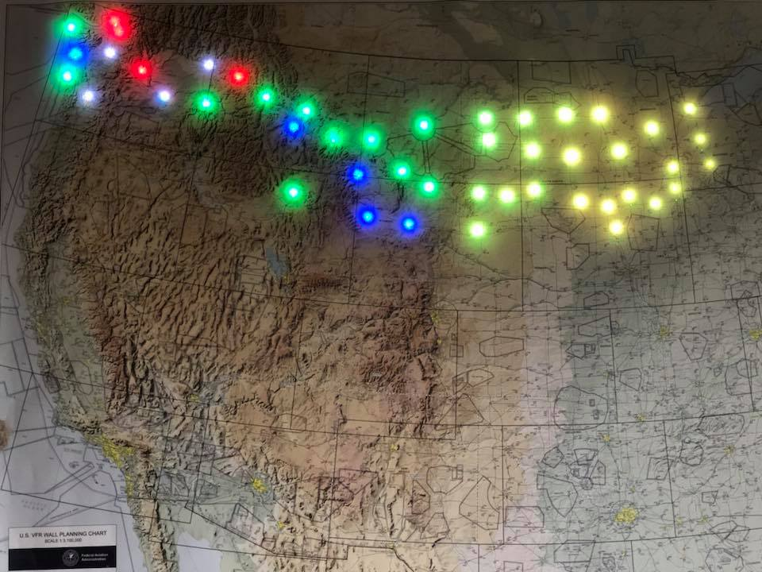
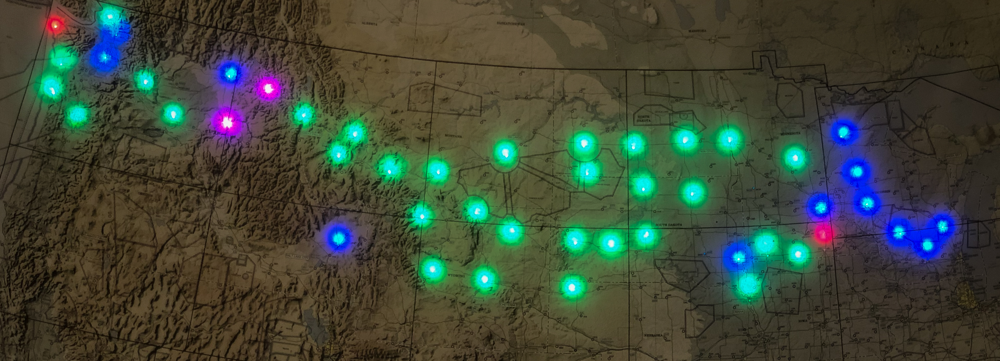
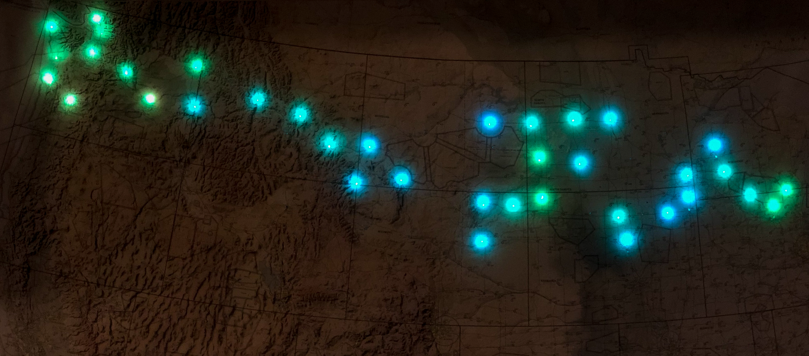
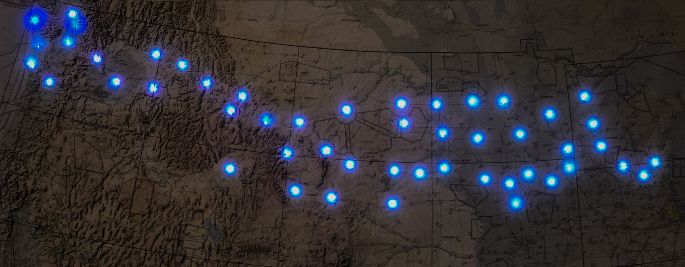
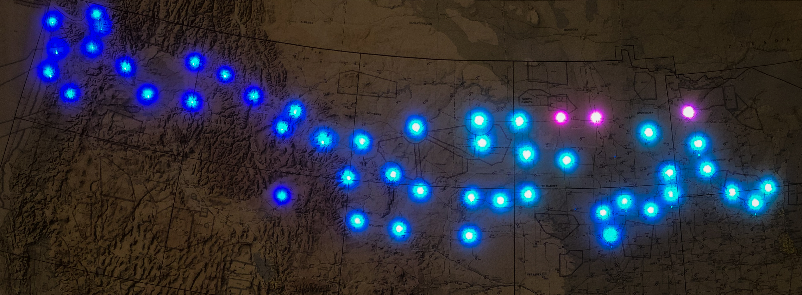
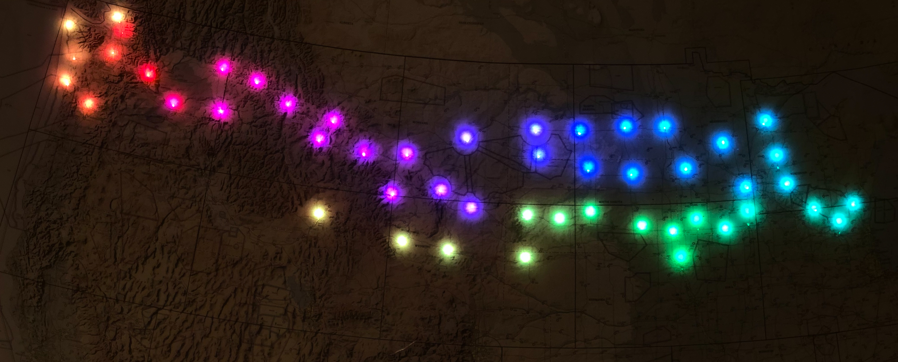
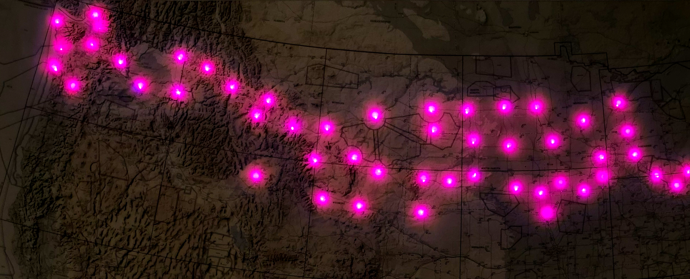

# VFR Light Map

This is a fork of Dylan Rush's excellent "[Categorical-Sectional](https://github.com/dylanrush/categorical-sectional)".

The purpose of this version is to allow for addressable RBG strips like the WS2801 and WS281x series ("NeoPixel") to be used. This allows for more stations and simplfies wiring.



## What You Need

### Skills Required

To complete this project you will need to:

- Edit two text files.
- Solder five wires.

### Additional Hardware

The instructions given here are for WS2801 and WS281x LED based strands, such as those found on AdaFruit.

The electronics cost about \$90 USD if you are buying everything new, and want 50 lights.

To complete the project you will need to supply your own chart and backing board. Instructions for mounting are not provided.

To finish the installation you will need a monitor, and a keyboard.

#### Supported Raspberry Pis

The parts manifest lists a Raspberry Pi Zero due to its size and lower power consumption, but a Raspberry Pi 3 is also suitable. The wiring diagram does not change. You may want to consider using a Pi3b for installations of 150 LEDs or more to retain performance and responsiveness in the remote control application.

## Setup

### Parts List

#### WS2801 Build (50 Lights)

| Description                                  | Link                                                                                                                                                                   |
| -------------------------------------------- | ---------------------------------------------------------------------------------------------------------------------------------------------------------------------- |
| Raspberry Pi Zero W                          | <https://www.amazon.com/CanaKit-Raspberry-Wireless-Starter-Official/dp/B06XJQV162/ref=sr_1_7?s=electronics&ie=UTF8&qid=1528557992&sr=1-7&keywords=raspberry+pi+zero+w> |
| 5 volt, 4 amp power supply                   | <https://www.amazon.com/gp/product/B00MRGKPH8/ref=oh_aui_detailpage_o06_s00?ie=UTF8&psc=1>                                                                             |
| Barrel jack adapters                         | <https://www.amazon.com/gp/product/B01M4RBARQ/ref=oh_aui_detailpage_o06_s01?ie=UTF8&psc=1>                                                                             |
| Individually addressable LEDs (WS2801 based) | <https://www.amazon.com/12mm-Diffused-Digital-Pixels-Strand/dp/B073MZWBYS/ref=sr_1_1?ie=UTF8&qid=1528558371&sr=8-1&keywords=adafruit+ws2801>                           |
| 4 Pin JST SM Plugs                           | <https://www.amazon.com/Visdoll-Pairs-Female-Connector-Cable/dp/B075K48BD9/ref=sr_1_8?ie=UTF8&qid=1528559351&sr=8-8&keywords=4+Pin+JST+SM+Plug>                        |

#### WS281x Build (Supports up to 150 Lights)

| Description                 | Link                                                                                                                                            |
| --------------------------- | ----------------------------------------------------------------------------------------------------------------------------------------------- |
| Raspberry Pi 3B+ W          | <https://www.amazon.com/CanaKit-Raspberry-Power-Supply-Listed/dp/B07BC6WH7V/ref=sr_1_3?dchild=1&keywords=pi+3b%2B&qid=1600757525&sr=8-3>        |
| 5 volt, 10 amp power supply | <https://www.amazon.com/gp/product/B07CMM2BBR/ref=ppx_yo_dt_b_asin_title_o03_s00?ie=UTF8&psc=1>                                                 |
| Quad Level Logic Shifter    | <https://www.amazon.com/gp/product/B01M4RBARQ/ref=oh_aui_detailpage_o06_s01?ie=UTF8&psc=1>                                                      |
| NeoPixel strands            | <https://www.adafruit.com/product/4560>                                                                                                         |
| 4 Pin JST SM Plugs          | <https://www.amazon.com/Visdoll-Pairs-Female-Connector-Cable/dp/B075K48BD9/ref=sr_1_8?ie=UTF8&qid=1528559351&sr=8-8&keywords=4+Pin+JST+SM+Plug> |

### Upgrade Instructions

If you are upgrading from Version 1.6 or earlier, please follow the instructions in [upgrade.md](./media/upgrade.md)

### Operating System Install

Please follow the guide in [media/os_install.md](./media/os_install.md) for instructions on how to install the operating system and supporting code required to run the WeatherMap software.

## Wiring

### Wiring WS2801 LEDs

Please follow the instructions in [media/ws2801_wiring.md](./media/ws2801_wiring.md)

### Wiring WS281x LEDs

Please follow the instructions in [media/neopixel_wiring.md](./media/neopixel_wiring.md)

## Understanding The Configuration Files

All of the configuration files with the **default** values will be in the "data" sub directory.

Unless you are building the same exact map that I did (Puget Sound to Oshkosh), then you will want to modify at least one of these values.

To help separate changes you make to personalize the map, you may create a user directory to holds values that override the defaults.

You will need to create a directory that branches from your home folder. This home folder has the special shortcut in Unix-like operating systems of `~`

To create this directory use the following command from a command line.

```bash
mkdir ~/weather_map
```

If you are using the default user of `pi`, then the full name of this directory is `/user/home/pi/weather_map/`.

### ~/weather_map/config.json

This is the first file loaded. It tells the software what type of lights are being used, and which airport file to open.

You do not need to include ALL of these values. Any values provided in this file OVERRIDE the default values. This shows what the defaults are.

```json
{
  "mode": "ws2801",
  "pixel_count": 50,
  "spi_device": 0,
  "spi_port": 0,
  "airports_file": "data/kawo_to_kosh.json",
  "blink_old_stations": true,
  "night_lights": true,
  "night_populated_yellow": false,
  "snow_pulse": false,
  "snow_twinkle": true,
  "night_category_proportion": 0.05,
  "brightness_proportion": 1.0,
  "visualizer": 0
}
```

Note: If you create your own mapping file for the LEDs, the `~/weather_map` directory is the best place to put it.

Here is an example of using overriding values:

```json
{
  "airports_file": "~/weather_map/puget_sound_region.json",
  "blink_old_stations": false,
  "night_category_proportion": 0.1,
  "brightness_proportion": 0.5
}
```

In this example we are using the file `puget_sound_region.json` to define our mapping. This file is expected to be in the `/home/pi/weather_map` folder. We are also reducing the overall brightness (ever during the day) by 50% of what the lights are capable of.

#### visualizer

This tells the WeatherMap which pluggin to use to show the weather data. This allows the same weather data to be shown in different ways.

The value of `0` is the default and shows you the "Flight Rules" visualization.

Valid values are from 0 to 5 (inclusive)

#### blink_old_stations

Set this to `false` if you would like the stations to remain the last known category/color even if the data is old.

The default is `true`. When the value is set to `true` any station with data older than 90 minutes will start blinking to indicate that the data is old.

When new data is received that has an issue date less than 90 minutes from the current time, then the light will stop blinking.

#### night_lights

Set this to `true` if you would like the weather stations to change colors based on the time of day.

This is a gradual process.

First the light will fade from the flight condition color to a bright yellow to indicate "Populated night". As the station gets darker, the light fades to a darker yellow by the time the station is "pitch black" in night.

In the morning, the light will increase back to a bright yellow as the office sunrise time approaches. As the station approaches full daylight, the light will fade from bright yellow to the color appropriate for the flight condition.

#### night_populated_yellow

Set this to `true` if you would like the day/night transition to show stations that are currently in "full dark" using yellow.

This will transition/fade into yellow from the standard category color.

Setting this to `false` will result in the category color fading. The amount the category fades is determined by `night_category_proportion`


#### snow_pulse

Set this to `true` if you would like stations that are reporting snow to pulse between a low light and white while using the Precipitation visualizer. This is overriden by the twinkle option.

Defaults to `false`.

#### snow_twinkle

Set this to `true` if you would like stations that are reporting snow to twinkle between a low light and white while using the Precipitation visualizer.

Defaults to `true`.

#### night_category_proportion

This is only used when `night_populated_yellow` is set to `false`.

The default value is `0.05`, or 5%. This means that when the station is in "full dark" that the normal category color will be reduced to 5% of the normal strength.

This creates a pleasant fade as stations on the chart transition from day to night, back to day.

_NOTE:_ This will not work with standard mode GPIO based LEDs.

#### brightness_proportion

This an adjustment to the LED brightness. It is applied AFTER all other light calculations are performed.

The intent is to provide a way to dim the LEDs during daylight hours.

This is a proportion

- `0.0` will result in all lights effectively being turned off.
- `0.5` will result in the lights being half as bright.
- `1.0` will result in no change.

You may need to adjust `night_category_proportion` if you use this value. A low enough value of `brightness_proportion` may result in LEDs for stations in the dark to result in not being visible. Increasing `night_category_proportion` will result in the LEDs being turned on again.

#### mode

This controls which type of LED system to use for controlling the lights.

| Value  | Description                                                                        |
| ------ | ---------------------------------------------------------------------------------- |
| ws2801 | Use WS2801 based light strands like those from AdaFruit                            |
| ws281x | Use WS2811, WS2812, or WS2812B LEDs. These are branded as "NeoPixels" by AdaFruit. |
| led    | Use standard LEDs that have a positive wire for each color and a common ground.    |

#### pixel_count

If you are using ws2801 based LEDs then you may need to change "pixel_count". Each strand will come with a numbe rof LEDs. You you are using a single strand, then set this number to that count. If you have combined strands, then set the total number of lights.

#### spi_device and spi_port

You will probably not need to change this. If you do need to change this, then you probably know what to do.

#### airports_file

This is the file that contains the airport names and the wiring configuration for them.

### Airports File

#### Annotated Example File

This shows the two sections for an example airport file.

```json
{
  "ws2801": [
    { "KRNT": { "neopixel": 0 } },
    { "KSEA": { "neopixel": 2 } },
    { "KPLU": { "neopixel": 4 } },
    { "KOLM": { "neopixel": 6 } },
    { "KTIW": { "neopixel": 8 } },
    { "KPWT": { "neopixel": 10 } },
    { "KSHN": { "neopixel": 12 } }
  ]
}
```

#### Explanation

There are two sections:

##### ws2801

This section contains the information required to control a strand of WS2801 OR WS281x led strips.

This starts with an airport or weather station identifier.

Next to contains a "neopixel" identifier. This is the order of the light on the strand.

_NOTE:_ The first light is "0", the second light is "1".

Due to the way your lights may need to be arranged to fit on the map, some lights may need to be skipped, so keep track of your lights.

##### Illustration of Numbering

Using the first few lines of the ws2801 section from above, this shows how the numbering works.

This project uses "zero based indexing".

In this scenario the second and fourth light are not used. They will remain off the entire time.

The first light is assigned to Renton airport. The third light will show SeaTac aiport.

```code
[Pi] ------[LED]------[LED]------[LED]------[LED]

           0/KRNT    Skipped     2/KSEA    Skipped
```

## Testing The LED Wiring

There is a self-test file included to help quickly validate your wiring. This works for both WS2801 and LED based maps.

This file exercises the LED lights without having to wait for the entire mapping software to initialize.

You may use it from a bash command-line:

```bash
cd ~
cd categorical-sectional
python3 check_lights_wiring.py
```

Please note that this will only run on a Raspberry Pi.

Also note that you will need to run this from a command terminal and that the self-check will run in a loop until stopped. From a terminal you may use `ctrl+c` to stop the task.

This self-test runs in two phases:

1. All of the lights will cycle through all of the active colors. Any lights that do not turn on may not be configured properly or may not be wired correctly.
2. All lights will turn off. The tool will tell you which LED is turned on (by number, starting a `0`), along with the station identifier currently set in the configuration. The tool will then prompt you to press `{enter}` to move to the next light.

Please do not run the test WHILE the map code is running. Mutliple programs attempting to control the lights will produce unexpected results.

## Testing The Station Configuration

There is a self-test file included to help quickly validate your configuration files.

You may use it from a bash command-line:

```bash
cd ~
cd categorical-sectional
python3 check_config_files.py
```

This tool may be also run from a Windows, Linux, or Mac based machine.

It checks each weather station in your configuration.

Each station is:

- Checked against the FAA CSV file to validate the ICAO code.
- Checked to validate the civil twilight information can be fetched.
- Checked that a METAR can be retrieved.

Any failures will list the identifier code and the reason.

Not being able to fetch a weather report is not considered a fatal error if other data can be obtained. Any airport that had issues fetching weather will be listed, and may simply be temporarily down.

## Running It At Boot

To run it at boot, perform the following steps:

1. Log into the device as the user "pi" with password "raspberry".
1. `sudo apt install rng-tools`
1. `systemctl enable rng-tools`
1. `systemctl start rng-tools`
1. `crontab -e`
1. Select "Nano" (Option 1)
1. Enter the following text at the _bottom_ of the file: `@reboot sleep 90 && python3 /home/pi/categorical-sectional/controller.py &`
1. Save the file and exit.
1. sudo reboot now

Capitalization counts. The map lights should come on with each boot now.

## Installing Node & Optional Config Server

Installing the remote control softyware is optional.

For instructions, please read <media/remote_control.md>

## Visualizers

### Flight Rules

This is the default visualizer, and indicates the flight rules for a station based on the METAR.

The color set uses the standard base, but with some extensions.



#### Colors

This project uses "standard" airport coloring for flight rules category, along with some unique colors.

| Flight Rule | Color          |
| ----------- | -------------- |
| VFR         | Solid green    |
| MVFR        | Solid blue     |
| IFR         | Solid red      |
| LIFR        | Solid magenta  |
| Smoke       | Solid gray     |
| Night       | Solid yellow   |
| Error       | Blinking white |

This visualizer additional can indicate lightning.

This is done by blinking the flight rule color with yellow on a one second interval.

Please note that this visualizer DOES dim stations based on sunrise/sunset IF that mode is enabled.

### Temperature

This shows you the temperatures of the stations. Colors are blended from one decisions point to the next to give you a better idea of the temperature.

| Temperature    | Color  |
| -------------- | ------ |
| None           | Off    |
| 0F or colder   | Purple |
| 20F            | Blue   |
| 40F            | Green  |
| 60F            | Yellow |
| 80F            | Orange |
| 100F or hotter | Red    |

Please note that this visualizer DOES dim stations based on sunrise/sunset IF that mode is enabled.



### Precipitation

This shows you what the precipitation is for each station (if available)

| Condition | Color      |
| --------- | ---------- |
| None      | Gray       |
| Drizzle   | Light Blue |
| Rain      | Blue       |
| Snow      | White      |
| Ice       | Light Gray |
| Unknown   | Purple     |

Please note that if you have `snow_twinkle` enabled, then stations with snow will twinkle white.
If you have `snow_pulse` enabled, then snow stations will transition from the None color to white in a pulsing manner.

Please note that this visualizer DOES dim stations based on sunrise/sunset IF that mode is enabled.



### Pressure

This shows you the pressure (by inches of mercury) for the station if available.

| Condition            | Color      |
| -------------------- | ---------- |
| Pressure unavailable | OFF        |
| 29.8inHg or less     | Red        |
| 29.92inHg            | Light Blue |
| 30.2inHg or higher   | Blue       |

The visualizer will blend colors between any of the thresholds to show the gradient across the map.



### Rainbow

This could also be called "Party Mode". It ignores all weather data and cycles the lights through a rainbow. Each light will be a slightly different color and will cycle on its own.



### Light Cycle

This mode cycles all of the stations through the spectrum, but all stations shift color in unison.



## Apendix

<https://learn.adafruit.com/12mm-led-pixels/wiring>
<https://tutorials-raspberrypi.com/how-to-control-a-raspberry-pi-ws2801-rgb-led-strip/>
<https://www.raspberrypi.org/documentation/linux/usage/cron.md>

## Version History

| Version | Change                                                                                                                                                                                                                                                                                 |
| ------- | -------------------------------------------------------------------------------------------------------------------------------------------------------------------------------------------------------------------------------------------------------------------------------------- |
| 2.1     | Change precipitation visualizer to pulse the snow color to make it distinct from "nothing"
| 2.0.1   | Minor tweak to ceiling categorization.                                                                                                                                                                                                                                                 |
| 2.0     | Add a remote control app that allows for brightness, night effects, and more to be changed on the fly. Add support for WS2811 and WS2812 based lights. Major performance improvements for adressable RGB LEDs. Selectable visualizers. Removed support for hard wired GPIO based LEDs. |
| 1.10    | Add service that allows the configuration to be updated remotely without using the command line.                                                                                                                                                                                       |
| 1.9     | Add documentation about the upgrade process for existing installations. Add configuration to control if old data causes a light to blink or not.                                                                                                                                       |
| 1.8     | Use the configuration files provided as a default base, and then source user configuration from the user directory.                                                                                                                                                                    |
| 1.7     | Allow for the brightness of the lights to be dimmed. This affects both the daytime and nighttime colors.                                                                                                                                                                               |
| 1.6     | Updated documentation, wiring self-check file that uses the configuration to exercise each weather station for all colors.                                                                                                                                                             |
| 1.5     | New options that expand the day/night lighting cycle. Allows for dimmed category colors to be used instead of "night yellow.                                                                                                                                                           |
| 1.4     | Changes to map initialization to help with bad airport identifiers. Improve handling of mismatch between four and three letter long identifiers when determining day/night cycle.                                                                                                      |
| 1.3     | Performance improvements.                                                                                                                                                                                                                                                              |
| 1.2     | Migrated to Python 3.x                                                                                                                                                                                                                                                                 |
| 1.1     | Day / Night cycle.                                                                                                                                                                                                                                                                     |
| 1.0     | First release with addressable lights.                                                                                                                                                                                                                                                 |

## Credits

Airport Location data from <http://ourairports.com/data/> Airport sunrise/sunset data from <https://sunrise-sunset.org/api>

## License

This project is covered by the GPL v3 liscense.

Please see

<liscense.md>
</liscense.md>
