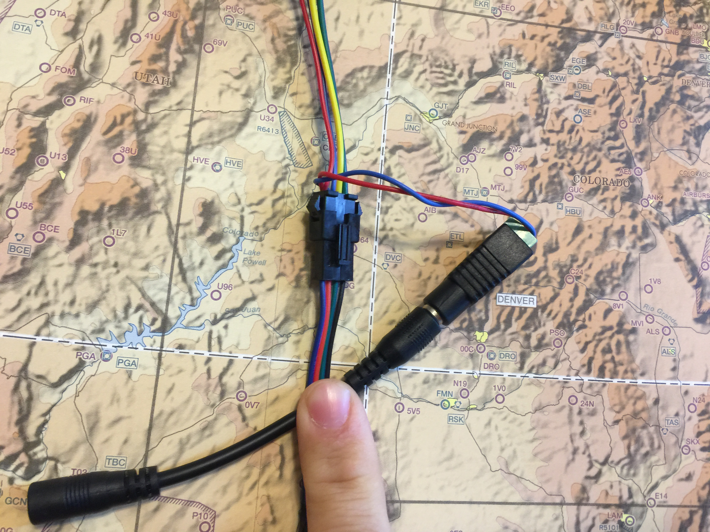
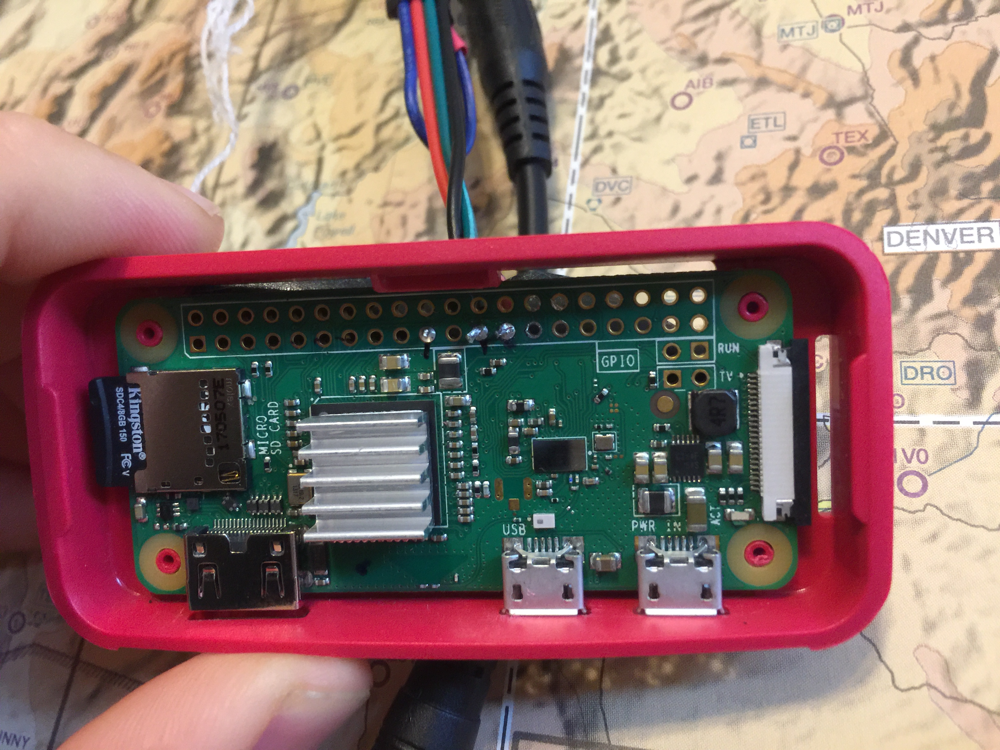
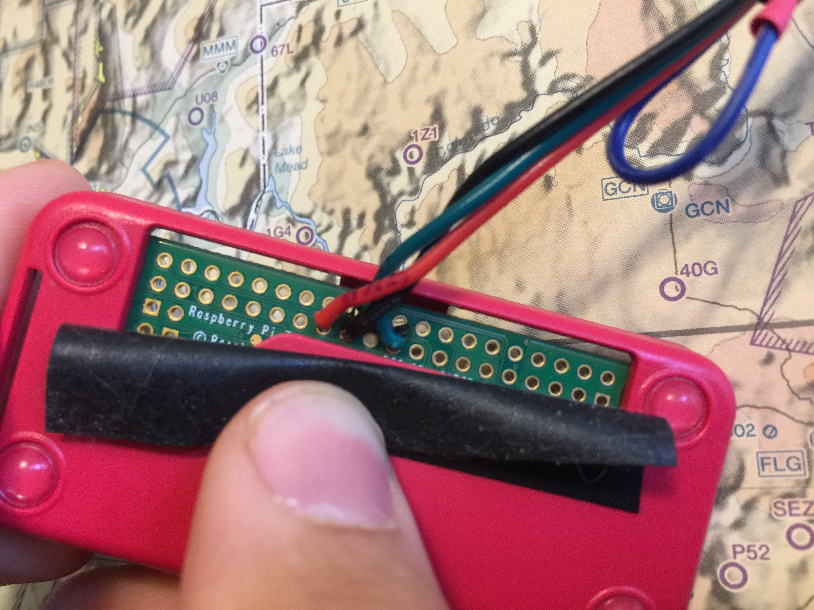

# VFR Light Map

This is a fork of Dylan Rush's excellent "[Categorical-Sectional](https://github.com/dylanrush/categorical-sectional)".

The purpose of this version was to unify the control code of different LED light types and to add support for WS2801 "individually" addressible LED lights.

I have also attempted to make setup easier by moving the LED configuration into data files.


## What You Need

### Skills Required

To complete this project you will need to:

- Edit two text files.
- Solder three wires.

### Additional Hardware

The instructions given here are for WS2801 LED based strands, such as those found on AdaFruit.

The electronics cost about \$90 USD if you are buying everything new, and want 50 lights.

To complete the project you will need to supply your own chart and backing board.

Soldering is required for three (3) wires, along with some electrical tape.

To finish the instalation you will need a monitor, and a keyboard.

#### Other Raspberry Pis

A parts manifest lists a Raspberry Pi Zero due to its size and lower power consumption, but a spare 2 or 3 will work as long as it has WiFi. The wiring diagram does not change.

## Setup

### Parts List

| Description                                  | Cost    | Link                                                                                                                                                                   |
| -------------------------------------------- | ------- | ---------------------------------------------------------------------------------------------------------------------------------------------------------------------- |
| Raspberry Pi Zero W                          | \$29.99 | <https://www.amazon.com/CanaKit-Raspberry-Wireless-Starter-Official/dp/B06XJQV162/ref=sr_1_7?s=electronics&ie=UTF8&qid=1528557992&sr=1-7&keywords=raspberry+pi+zero+w> |
| 5 volt, 4 amp power supply                   | \$12.99 | <https://www.amazon.com/gp/product/B00MRGKPH8/ref=oh_aui_detailpage_o06_s00?ie=UTF8&psc=1>                                                                             |
| Barrel jack adapters                         | \$7.99  | <https://www.amazon.com/gp/product/B01M4RBARQ/ref=oh_aui_detailpage_o06_s01?ie=UTF8&psc=1>                                                                             |
| Individually addressable LEDs (WS2801 based) | \$39.95 | <https://www.amazon.com/12mm-Diffused-Digital-Pixels-Strand/dp/B073MZWBYS/ref=sr_1_1?ie=UTF8&qid=1528558371&sr=8-1&keywords=adafruit+ws2801>                           |
| 4 Pin JST SM Plugs                           | \$7.99  | <https://www.amazon.com/Visdoll-Pairs-Female-Connector-Cable/dp/B075K48BD9/ref=sr_1_8?ie=UTF8&qid=1528559351&sr=8-8&keywords=4+Pin+JST+SM+Plug>                        |

### Bootstrapping The Raspberry Pi

#### OS Instalation

This section gets you started with instaling the software.

A full tutorial on how to install the Operating System is available at: <https://www.raspberrypi.org/documentation/installation/noobs.md>

1. Boot the Raspberry Pi with the empty SD card.
2. You will be given a choice of operating systems to install. You will also be asked for your WiFi network and password.
3. Choose the WiFi network that will be used when the project is completed.
4. Choose "Raspbian" as the operating system.
5. When it is finished, login with the username:pi password:raspberry

#### Get The Code

From the command line, after logging in:

```bash
cd ~
git clone https://github.com/JohnMarzulli/categorical-sectional.git
```

This will install this software onto the Raspberry Pi.

#### Python Package Install

From a terminal on the Raspberry Pi

```bash
cd ~/categorical-sectional
sudo python3 setup.py develop
```

#### Raspberry Pi Settings

Run 'raspi-config' and enable the SPI bus under Advanced

```bash
sudo raspi-config
```

## Wiring

### Wiring the WS2801

If you are using multiple strands of lights, plug them together.
Tape off the red and blue tap wires between the connectors and at the end of the strand.

Leave the read and blue wire at the start of the strand for the moment.

### The Barrel Jack Adapter

For the barrel jack, use the two thinner wires that come out of the top of the plastic connector from the LED lights.

One is red, the other blue.

- Blue -> Barrel jack minus
- Red -> Barrel jack positive

#### Wiring Detail For Barrel Jack



### The Raspberry Pi

Use the group of four wires from a _*male*_ JST SM adapter.

Solder them to the board.

| Wire Color | Physical Pin                                | Pin Name      |
| ---------- | ------------------------------------------- | ------------- |
| Blue       | Tied off and shrink wrapped. Not connected. | Not connected |
| Red        | 25                                          | GRND          |
| Black      | 23                                          | SCLK          |
| Green/Teal | 19                                          | MOSI          |

#### Wiring Detail From Top



#### Wiring Detail From Bottom



## Final Assembly

- Connect the Male JST and LED connectors together.
- Connect the barrel jack into the Neopixel strip.
- Add the SD card to the Pi.
- Plug inthe NeoPixels first, then the Raspberry Pi.

## Understanding The Configuration Files

All of the configuration files will be in the "data" sub directory.

Unless you are building the same exact map that I did (Puget Sound to Oshkosh), then you will want to modify at least one of these.

### data/config.json

This is the first file loaded. It tells the software what type of lights are being used, and which airport file to open.

```json
{
  "mode": "ws2801",
  "pixel_count": 50,
  "spi_device": 0,
  "spi_port": 0,
  "pwm_frequency": 100,
  "airports_file": "data/kawo_to_kosh.json",
  "night_lights": true
}
```

#### night_lights

Set this to true if you would like the weather stations to change colors based on the time of day.

If you are using WS2801 or PWM based lights, then this is a gradual process.

First the light will fade from the flight condition color to a bright yellow to indicate "Populated night".
As the station gets darker, the light fades to a darker yellow by the time the station is "pitch black" in night.

In the morning, the light will increase back to a bright yellow as the office sunrise time approaches.
As the station approaches full daylight, the light will fade from bright yellow to the color appropriate for the flight condition.

#### mode

This controls which type of LED system to use for controlling the lights.

| Value  | Description                                                                                      |
| ------ | ------------------------------------------------------------------------------------------------ |
| ws2801 | Use WS2801 based light strands like those from AdaFruit                                          |
| pwm    | Use pulse width modulation based LEDs. This can have their colors changed more than normal LEDs. |
| led    | Use standard LEDs that have a positive wire for each color and a common ground.                  |

#### pixel_count

If you are using ws2801 based LEDs then you may need to change "pixel_count". Each strand will come with a numbe rof LEDs. You you are using a single strand, then set this number to that count. If you have combined strands, then set the total number of lights.

#### spi_device and spi_port

You will probably not need to change this. If you do need to change this, then you probably know what to do.

#### pwm_frequency

Used if you are using PWM LEDs.

#### airports_file

This is the file that contains the airport names and the wiring configuration for them.

### Airports File

#### Annotated Example File

This shows the two sections for an example airport file.

```json
{
  "pwm": [
    { "KRNT": [3, 5, 7] },
    { "KSEA": [11, 13, 15] },
    { "KPLU": [19, 21, 23] },
    { "KOLM": [29, 31, 33] },
    { "KTIW": [32, 35, 37] },
    { "KPWT": [36, 38, 40] },
    { "KSHN": [8, 10, 12] }
  ],
  "ws2801": [
    { "KRNT": { "neopixel": 0 } },
    { "KSEA": { "neopixel": 2 } },
    { "KPLU": { "neopixel": 4 } },
    { "KOLM": { "neopixel": 6 } },
    { "KTIW": { "neopixel": 8 } },
    { "KPWT": { "neopixel": 10 } },
    { "KSHN": { "neopixel": 12 } }
  ]
}
```

#### Explanation

There are two sections:

##### pwm

Contains the airport name and wiring information. The first number is the wire controlling the red LED, then the green LED, and finally the blue LED.

These wire numbers refer to the _*physical*_ board number on the Raspberry pie.

So for KRNT (Renton), the wire leading to the Red LED would be wired to the GPIO board at pin 3. The Blue LED would be wired to pin 5, and the green LED wire would be wired to pin 7.

_NOTE:_ The "pwm" section is used by both the normal LEDs and the pulse width controlled LEDs.

##### ws2801

This section contains the information required to control a strand of WS2801 lights.

Once again, this starts with an airport or weather station identifier.

Next to contains a "neopixel" identifier. This is the order of the light on the strand.

_NOTE:_ The first light is "0", the second light is "1".

Due to the way your lights may need to be arranged to fit on the map, some lights may need to be skipped, so keep track of your lights.

##### Illustration of Numbering

Using the first few lines of the ws2801 section from above, this shows how the numbering works.

This project uses "zero based indexing".

In this scenario the second and fourth light are not used. They will remain off the entire time.

The first light is assigned to Renton airport.
The third light will show SeaTac aiport.

```code
[Pi] ------[LED]------[LED]------[LED]------[LED]

           0/KRNT    Skipped     2/KSEA    Skipped
```

## Running It At Boot

To run it at boot, perform the following steps:

1. Log into the device as the user "pi" with password "raspberry".
2. Type "crontab -e"
3. Select "Nano" (Option 1)
4. Enter the following text at the _bottom_ of the file:

```code
@reboot python3 /home/pi/categorical-sectional/controller.py &
```

5. Save the file and exit.
6. sudo reboot now

Capitalization counts. The map lights should come on with each boot now.

## Colors

This project uses "standard" airport coloring for flight rules category, along with some unique colors.

| Flight Rule | WS2801         | PWM            | LED            |
| ----------- | -------------- | -------------- | -------------- |
| VFR         | Solid green    | Solid green    | Solid green    |
| MVFR        | Solid blue     | Solid blue     | Solid blue     |
| IFR         | Solid red      | Solid red      | Solid red      |
| LIFR        | Solid magenta  | Solid magenta  | Blinking red   |
| Smoke       | Solid gray     | Solid gray     | Solid gray     |
| Night       | Solid yellow   | Solid yellow   | Solid yellow   |
| Error       | Blinking white | Blinking white | Blinking white |

## Apendix

<https://learn.adafruit.com/12mm-led-pixels/wiring>
<https://tutorials-raspberrypi.com/how-to-control-a-raspberry-pi-ws2801-rgb-led-strip/>
<https://www.raspberrypi.org/documentation/linux/usage/cron.md>

## Version History

| Version | Change                                                                                                                                                                            |
| ------- | --------------------------------------------------------------------------------------------------------------------------------------------------------------------------------- |
|   1.5   | New options that expand the day/night lighting cycle. Allows for dimmed category colors to be used instread.                                                                      |
|   1.4   | Changes to map initialization to help with bad airport identifiers. Improve handling of mismatch between four and three letter long identifiers when determining day/night cycle. |
|   1.3   | Performance improvements.                                                                                                                                                         |
|   1.2   | Migrated to Python 3.x                                                                                                                                                            |
|   1.1   | Day / Night cycle.                                                                                                                                                                |
|   1.0   | First release with adressable lights.                                                                                                                                             |

## Credits

Airport Location data from <http://ourairports.com/data/>
Airport sunrise/sunset data from <https://sunrise-sunset.org/api>

## License

This project is covered by the GPL v3 liscense.

Please see [LISCENSE.md](LISCENSE.md)
